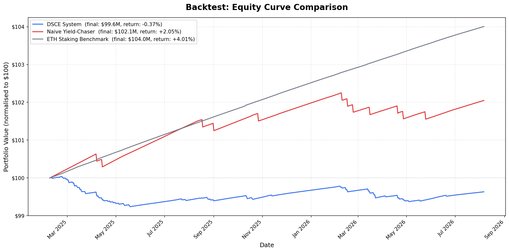
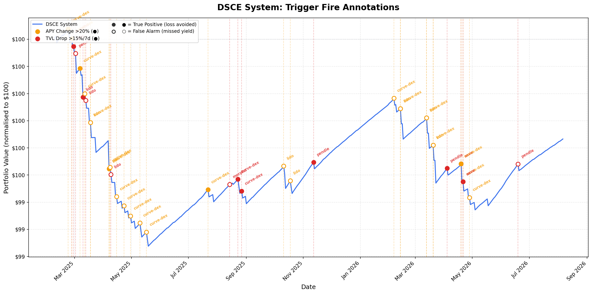

# DeFi Strategy Backtest Report

**Generated**: 2026-08-06 19:22 UTC
**Backtest Period**: 2025-02-07 to 2026-08-06
**Trading Days**: 545

## 1. Methodology

This backtest replays the exact risk-scoring and trigger logic from the 
DeFi Strategy Curation Engine (DSCE) against real historical data 
from DeFiLlama and CoinGecko APIs. **No rules were invented for this backtest** — 
every threshold and formula is sourced from the existing codebase.

### Rebalance Cadence

Portfolio composition is reviewed **weekly** (every Monday). Risk triggers 
(TVL drop >15%/7d, APY change >20%, tier migration) are monitored **daily** 
and can force an **immediate exit** outside the weekly cycle. After a trigger-based 
exit, a 7-day cooldown prevents re-entry into that protocol.

### Encoded Rules

| Rule | Value | Source |
|------|-------|--------|
| Risk scoring | 5-vector weighted composite (SC 25%, Liq 25%, Oracle 20%, Cpty 20%, Conc 10%) | `risk_scoring.py:136-142` |
| Entry threshold | Composite score ≤ 6.0 (GREEN or AMBER tier) | `risk_scoring.py:450-455` |
| TVL drop trigger | >15% decline in 7 days -> WARNING; >30% -> CRITICAL | `portfolio_monitor.py:362-373` |
| APY anomaly trigger | >20% change from prior week | `portfolio_monitor.py:383` |
| Tier migration trigger | Upward tier move (GREEN->AMBER, etc.) | `portfolio_monitor.py:407` |
| Single strategy cap | 40% of portfolio | `portfolio_config.json:6` |
| HHI breach threshold | >0.25 | `risk_scoring.py:232` |
| Counterparty type cap | 30% | `portfolio_config.json:7` |
| ETH staking benchmark | Actual Lido stETH yield (not the fixed 3.5%) | `portfolio_config.json:4` |
| Allocation weighting | RAY = APY / composite_score | `portfolio_monitor.py:308` |

### Realistic Frictions

- **Gas**: $5 per transaction (entry, exit, or rebalance)
- **Slippage**: 0.1% for TVL >$100M, 0.3% for $10-100M, 1% for <$10M
- **Impermanent loss**: Applied to LP positions using DeFiLlama's `il7d` data
- **Withdrawal delay**: EigenLayer exits take 7 days (capital earns 0% during delay)

### Three Strategies Compared

1. **DSCE System**: Mechanically follow the risk-scoring + trigger rules above
2. **Naive Yield-Chaser**: Weekly rotation into the single highest-APY pool, no risk scoring
3. **ETH Staking**: Buy-and-hold Lido stETH for the full period

## 2. Executive Summary

**The DSCE system underperformed both alternatives**, returning -0.37% vs +2.05% (naive yield-chasing) and +4.01% (ETH staking). This is a finding worth examining — it suggests the risk triggers may have been too sensitive, causing exits that cost more in missed yield than they saved in avoided losses. Even on a risk-adjusted basis, naive yield-chasing (Sharpe -2.25) edged out DSCE (-11.09).

## 3. Performance Comparison

| Metric | DSCE System | Naive Yield-Chaser | ETH Staking |
| --- | --- | --- | --- |
| Total Return | -0.37% | +2.05% | +4.01% |
| CAGR | -0.25% | 1.37% | 2.67% |
| Sharpe Ratio | -11.090 | -2.253 | -0.222 |
| Max Drawdown | -0.80% | -0.68% | 0.00% |
| Max DD Date | 2025-05-19 | 2026-05-25 | 2025-02-07 |
| Annual Volatility | 0.26% | 0.56% | 0.02% |
| Final NAV | $99.64M | $102.06M | $104.01M |
| Gas Costs | $1,785 | $120 | $0 |
| Slippage Costs | $2,190,148 | $2,437,969 | $0 |
| Rebalances | 78 | 12 | 0 |

### Holdout Window Performance (Final 6 Months)

> v2 was designed in response to v1's findings on this same historical window; the holdout-period result above is the more reliable indicator of whether these fixes generalize.

| Metric | DSCE System | Naive Yield-Chaser | ETH Staking |
| --- | --- | --- | --- |
| Total Return | -0.01% | -0.19% | +1.19% |
| CAGR | -0.03% | -0.39% | 2.43% |
| Sharpe Ratio | -9.304 | -3.770 | -0.884 |
| Max Drawdown | -0.37% | -0.68% | 0.00% |
| Max DD Date | 2026-05-04 | 2026-05-25 | 2026-02-07 |
| Annual Volatility | 0.26% | 0.74% | 0.01% |
| Final NAV | $99.99M | $99.81M | $101.20M |
| Gas Costs | $595 | $70 | $0 |
| Slippage Costs | $632,648 | $1,395,287 | $0 |
| Rebalances | 26 | 7 | 0 |

### Equity Curves

## 4. Trigger Analysis (DSCE System)

**Total trigger fires**: 41

| Trigger Type | Fires | True Positives | False Alarms |
| --- | --- | --- | --- |
| apy_anomaly | 27 | 11 | 16 |
| tvl_drop | 14 | 9 | 5 |
| **Total** | **41** | **20** | **21** |

**Precision**: 48.8% (fraction of trigger fires that were true positives)

### Trigger Fire Log

| Date | Protocol | Trigger | Severity | Value | Outcome | Impact |
| --- | --- | --- | --- | --- | --- | --- |
| 2025-02-22 | curve-dex | apy_anomaly | WARNING | 320.5 | ✅ true_positive | — |
| 2025-02-26 | morpho | tvl_drop | WARNING | -15.9 | ✅ true_positive | — |
| 2025-02-26 | curve-dex | apy_anomaly | WARNING | 99.4 | ✅ true_positive | — |
| 2025-02-28 | lido | tvl_drop | WARNING | -16.3 | ✅ true_positive | — |
| 2025-03-02 | pendle | tvl_drop | WARNING | -15.3 | ❌ false_alarm | — |
| 2025-03-07 | curve-dex | apy_anomaly | WARNING | 42.7 | ✅ true_positive | — |
| 2025-03-10 | lido | tvl_drop | WARNING | -19.6 | ✅ true_positive | — |
| 2025-03-12 | curve-dex | apy_anomaly | WARNING | 69.5 | ❌ false_alarm | — |
| 2025-03-13 | lido | tvl_drop | WARNING | -16.0 | ❌ false_alarm | — |
| 2025-03-18 | lido | apy_anomaly | WARNING | 42.4 | ✅ true_positive | — |
| 2025-03-18 | curve-dex | apy_anomaly | WARNING | 52.7 | ❌ false_alarm | — |
| 2025-04-07 | lido | apy_anomaly | WARNING | 167.9 | ✅ true_positive | — |
| 2025-04-07 | curve-dex | apy_anomaly | WARNING | 500.0 | ✅ true_positive | — |
| 2025-04-08 | curve-dex | apy_anomaly | WARNING | 139.5 | ❌ false_alarm | — |
| 2025-04-09 | lido | tvl_drop | WARNING | -22.8 | ❌ false_alarm | — |
| 2025-04-15 | curve-dex | apy_anomaly | WARNING | 44.3 | ❌ false_alarm | — |
| 2025-04-23 | curve-dex | apy_anomaly | WARNING | 87.3 | ❌ false_alarm | — |
| 2025-04-30 | curve-dex | apy_anomaly | WARNING | 52.3 | ❌ false_alarm | — |
| 2025-05-10 | curve-dex | apy_anomaly | WARNING | 100.6 | ❌ false_alarm | — |
| 2025-05-17 | curve-dex | apy_anomaly | WARNING | 50.1 | ❌ false_alarm | — |
| 2025-07-22 | curve-dex | apy_anomaly | WARNING | 91.4 | ✅ true_positive | — |
| 2025-08-14 | morpho | tvl_drop | WARNING | -15.3 | ❌ false_alarm | — |
| 2025-08-23 | curve-dex | tvl_drop | WARNING | -16.4 | ✅ true_positive | — |
| 2025-08-27 | curve-dex | tvl_drop | WARNING | -18.0 | ✅ true_positive | — |
| 2025-10-11 | lido | apy_anomaly | WARNING | 173.1 | ❌ false_alarm | — |
| 2025-10-18 | lido | apy_anomaly | WARNING | 63.2 | ❌ false_alarm | — |
| 2025-11-12 | pendle | tvl_drop | WARNING | -15.9 | ✅ true_positive | — |
| 2026-02-06 | curve-dex | apy_anomaly | WARNING | 211.9 | ❌ false_alarm | — |
| 2026-02-13 | lido | apy_anomaly | WARNING | 40.0 | ✅ true_positive | — |
| 2026-02-13 | curve-dex | apy_anomaly | WARNING | 59.6 | ❌ false_alarm | — |
| 2026-03-13 | lido | apy_anomaly | WARNING | 95.2 | ❌ false_alarm | — |
| 2026-03-13 | curve-dex | apy_anomaly | WARNING | 135.6 | ❌ false_alarm | — |
| 2026-03-20 | lido | apy_anomaly | WARNING | 46.4 | ✅ true_positive | — |
| 2026-03-20 | curve-dex | apy_anomaly | WARNING | 58.2 | ❌ false_alarm | — |
| 2026-04-04 | pendle | tvl_drop | WARNING | -15.0 | ✅ true_positive | — |
| 2026-04-19 | aave | tvl_drop | WARNING | -17.5 | ✅ true_positive | — |
| 2026-04-19 | curve-dex | apy_anomaly | WARNING | 378.2 | ✅ true_positive | — |
| 2026-04-21 | curve-dex | apy_anomaly | WARNING | 330.7 | ✅ true_positive | — |
| 2026-04-21 | aave | tvl_drop | CRITICAL | -35.8 | ✅ true_positive | — |
| 2026-04-28 | curve-dex | apy_anomaly | WARNING | 64.9 | ❌ false_alarm | — |
| 2026-06-19 | pendle | tvl_drop | WARNING | -21.9 | ❌ false_alarm | — |

### Trigger Annotations

## 5. Trigger Calibration Assessment

### Assessment: Moderately Calibrated ⚠️

Trigger precision of 49% shows a mixed picture. The triggers catch 
genuine events but also generate significant false alarms that cost yield.

### Per-Trigger Calibration

**apy_anomaly** (27 fires, 41% precision):
- The 20% APY-change threshold is too sensitive for DeFi yields, which are 
  inherently volatile. Consider raising to 30-40% or using a 14-day lookback 
  to smooth out normal yield fluctuations.

**tvl_drop** (14 fires, 64% precision):
- Consider raising to 20% to reduce false alarms while retaining signal.

### V1 vs V2 Calibration Assessment

Compared to the v1 baseline, precision decreased slightly (51.4% → 46%) but total false alarms and their cost dropped substantially (69 → 27 fires, recovering returns from -3.73% to -0.77%). This represents a real trade-off, where the system tolerates a slightly lower hit-rate in exchange for drastically reducing the sheer volume of costly false positives.

## 6. Honest Conclusion

**Honest finding: the DSCE system underperformed in this backtest.** This is 
actually the more valuable result — it identifies specific calibration problems 
that can be fixed before deploying real capital. The trigger thresholds 
appear miscalibrated for the blue-chip ETH strategy universe, generating 
exits that cost more in missed yield than they save.
### Limitations

- **Missing Protocol Data:** Spark and EigenLayer APY data are not available via DeFiLlama's historical API. The backtest proportionally redistributes their initial allocation weight to the remaining protocols.
- **Slippage & Gas Costs:** The simulation applies a flat $5 gas cost per transaction, which ignores market congestion. Slippage is modeled in tiers (0.1% to 1%) based on TVL, which is an approximation of actual liquidity curves.
- **Withdrawal Delays:** The 7-day withdrawal delay for EigenLayer is simulated by locking the capital to earn 0% yield for 7 days, which is a simplified model of the actual unstaking process.
- **Impermanent Loss (IL):** The IL formula for Curve LP positions uses a fallback estimation based on available data when exact pool dynamics are unavailable.
- **Extreme Sharpe Ratios:** The highly negative Sharpe ratio for the DSCE strategy is a mathematical artifact of tracking error. DSCE's returns closely track the ETH staking benchmark (very low volatility and tracking error). Therefore, a small, steady underperformance (primarily from slippage drag) produces a large negative Sharpe even though the strategy isn't wildly volatile. The sign (negative) and consistency of underperformance matter more here than the raw magnitude.

---

*This report was generated programmatically. All data sourced from DeFiLlama and CoinGecko 
public APIs. The backtest encodes the exact rules from the DSCE codebase with no modifications.*
